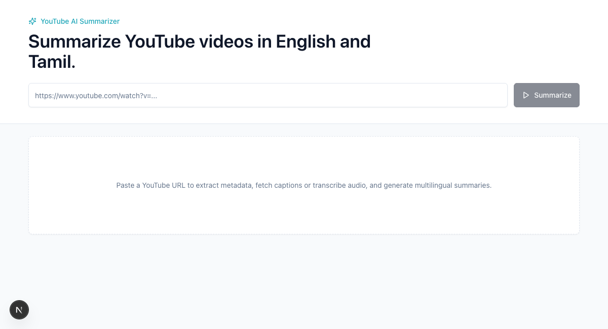

# YouTube AI Summarizer

> Turn any YouTube video into a concise, bilingual (English + Tamil) summary — with bullet-point takeaways, action items, key points, and clickable timestamps.

[](https://github.com/koushik/youtube-ai-summarizer/actions/workflows/ci.yml)
[](LICENSE)
[](https://nextjs.org/)
[](https://www.typescriptlang.org/)
[](CONTRIBUTING.md)
[](CODE_OF_CONDUCT.md)



## Why this exists

Long videos hide their value behind an hour of playback. YouTube AI Summarizer
extracts the substance in seconds: paste a URL and get a structured summary in
both **English** and **Tamil**, including action items for how-to content. It is
built to handle the messy reality of YouTube — many videos have no usable
captions, and a lot of regional content mixes Tamil and English in the same
sentence.

## Features

- 🔗 **Paste a URL** — extracts the video title, thumbnail, and duration.
- 📝 **Captions-first, transcription fallback** — uses YouTube captions when
  available; otherwise downloads the audio and transcribes it with
  `gpt-4o-mini-transcribe`.
- 🌐 **Bilingual output** — English and Tamil summaries, including mixed
  Tamil-English speech.
- 🔹 **Bullet-point summaries** — concise points instead of a wall of text.
- ✅ **Action items** — how-to/tutorial videos produce concrete, do-this-next
  steps. Non-actionable videos simply omit them.
- 📌 **Key points & timestamps** — the important moments, with jump-to times.

## How it works

The pipeline is captions-first and only pays for transcription when it has to:

```
                ┌─────────────────────────┐
  YouTube URL ─▶│ extract video metadata  │
                └─────────────┬───────────┘
                              ▼
                ┌─────────────────────────┐    captions usable?
                │ fetch YouTube captions  │──────────┐ yes
                └─────────────┬───────────┘          │
                       no / unusable                 │
                              ▼                       │
                ┌─────────────────────────┐          │
                │ download audio +        │          │
                │ transcribe (OpenAI)     │          │
                └─────────────┬───────────┘          │
                              ▼                       ▼
                ┌──────────────────────────────────────┐
                │ summarize transcript (Gemini)         │
                │ → English + Tamil JSON                │
                └──────────────────────────────────────┘
```

| Layer | Responsibility | Code |
| --- | --- | --- |
| `app/api/summarize` | HTTP entry point, request validation | [`route.ts`](app/api/summarize/route.ts) |
| `services/summarize.ts` | Orchestrates the pipeline | captions → transcription → summary |
| `services/youtube-captions.ts` | Caption fetching | — |
| `services/transcription.ts` | Audio download + OpenAI transcription fallback | — |
| `services/gemini.ts` | Gemini prompt + summarization + JSON parsing | — |
| `lib/` | Pure helpers (YouTube parsing, error types) | — |
| `components/` | React UI | — |

## Quick start

**Prerequisites:** Node.js `>= 18.18` and npm.

```bash
git clone https://github.com/koushik/youtube-ai-summarizer.git
cd youtube-ai-summarizer
npm install
cp .env.example .env.local   # then add your keys (see below)
npm run dev
```

Open <http://localhost:3000>.

## Configuration

Set these in `.env.local` (never commit this file — it is git-ignored):

| Variable | Required | Description |
| --- | --- | --- |
| `OPENAI_API_KEY` | For the transcription fallback | Used only when a video has no usable captions. |
| `GEMINI_API_KEY` | Yes | Gemini key used for summarization. |
| `GOOGLE_API_KEY` | Optional | Accepted as a fallback for the Gemini key. |
| `GEMINI_MODEL` | Optional | Defaults to `gemini-2.5-pro`. Set to e.g. `gemini-2.5-flash` for lower cost. |

## Cost

Costs depend on whether the video already has captions:

| Scenario | Approx. cost for a 1-hour video |
| --- | --- |
| Captions available (Gemini only) | **~$0.06–0.08** |
| No captions (OpenAI transcription + Gemini) | **~$0.25** |

Transcription is the dominant cost, so the captions-first design keeps most
requests well under $0.10. Switching `GEMINI_MODEL` to `gemini-2.5-flash` cuts
the summarization cost further. These are estimates based on published list
prices and vary with summary length and the model's thinking tokens.

## API

### `POST /api/summarize`

**Request**

```json
{ "youtubeUrl": "https://www.youtube.com/watch?v=..." }
```

**Response**

```json
{
  "video": { "id": "", "title": "", "thumbnail": "", "duration": "" },
  "transcript": "",
  "english": {
    "oneLineSummary": "",
    "shortSummary": "",
    "detailedSummary": [],
    "keyPoints": [],
    "actionItems": [],
    "importantTimestamps": [{ "time": "MM:SS", "label": "" }]
  },
  "tamil": {
    "oneLineSummary": "",
    "shortSummary": "",
    "detailedSummary": [],
    "keyPoints": [],
    "actionItems": [],
    "importantTimestamps": [{ "time": "MM:SS", "label": "" }]
  }
}
```

`detailedSummary`, `keyPoints`, and `actionItems` are arrays of strings.
`actionItems` is empty for non-actionable videos. Errors return
`{ "error": { "message": "", "code": "" } }` with an appropriate HTTP status.

## Tech stack

Next.js 15 (App Router) · TypeScript (strict) · Tailwind CSS · shadcn-style
local UI components · Google Gemini · OpenAI · `@distube/ytdl-core` /
`youtube-dl-exec` for audio.

## Roadmap

- [ ] Export summaries as Markdown / PDF
- [ ] Additional output languages
- [ ] Caching of previously summarized videos
- [ ] Streaming results as they are generated

## Contributing

Contributions are welcome! Please read [CONTRIBUTING.md](CONTRIBUTING.md) for dev
setup and conventions, and our [Code of Conduct](CODE_OF_CONDUCT.md). For
security issues, see [SECURITY.md](SECURITY.md).

## Limitations

- No database, authentication, queue, or persistence — each request runs
  end-to-end in a single API call, so long videos can take time.
- The audio fallback depends on YouTube allowing the stream to be fetched from
  the server environment.

## License

[MIT](LICENSE) © Koushik
